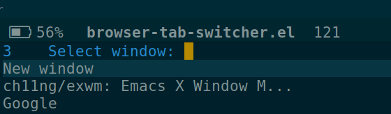

# emacs-browser-tab-switcher

I do not believe that web browser tab are useful. My workflow consists in
opening links in new windows, which I manage with Emacs and
[EXWM](https://github.com/ch11ng/exwm). `emacs-browser-tab-switcher` is small
package that provides a function `browser-tab-switcher` which is used to narrow
down switching to a new buffer to only the browser windows. Hence, various
windows behave like tabs.

## How does it work?

`emacs-browser-tab-switcher` looks at all the open buffers and finds the ones
with major mode EXWM and with a specific prefix. Therefore, to work, browser
windows must have a specific prefix. I use this function to add the prefix:
``` emacs-lisp
(defun exwm/rename-buffer ()
  (interactive)
  (exwm-workspace-rename-buffer
   ;; Get first word of the name
   (concat "(" (car (split-string exwm-class-name "[ \f\t\n\r\v-]+")) ") "
           (if (<= (length exwm-title) 30) exwm-title
             (concat (substring exwm-title 0 29) "...")))))

(add-hook 'exwm-update-class-hook 'exwm/rename-buffer)
(add-hook 'exwm-update-title-hook 'exwm/rename-buffer)
```


## Screenshot


